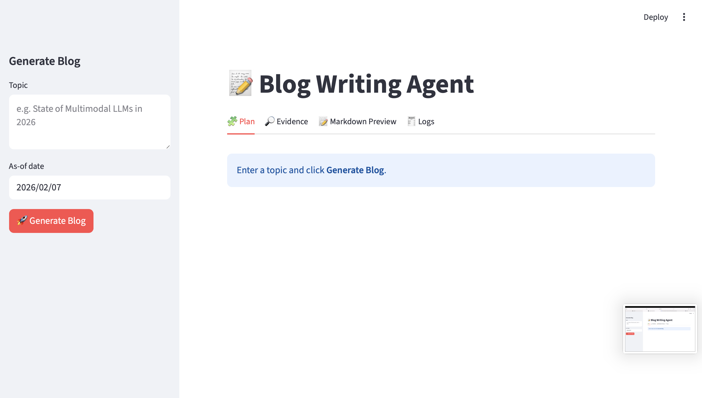
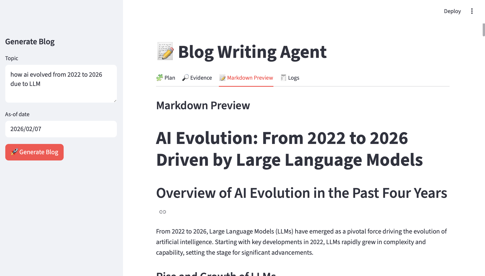

# 📝 LangGraph Blog Writing Agent

An **agentic AI system** that plans, researches, and writes high-quality technical blog posts using **LangGraph**, **LLMs**, and a **Streamlit UI**.

The agent dynamically decides whether web research is required, gathers evidence when needed, generates a structured writing plan, and writes each section independently before assembling a final Markdown blog post — ready for publishing.

---

## 🚀 Features

- 🧠 **Agentic Workflow (LangGraph)**
  - Intelligent routing: closed-book, hybrid, or open-book writing
  - Multi-node execution with planner, researcher, workers, and reducer

- 🔎 **Optional Web Research**
  - Uses Tavily Search for fresh, high-signal evidence
  - Automatic citation handling for up-to-date claims

- 🧩 **Structured Blog Planning**
  - Audience, tone, blog type
  - Section-wise goals, bullets, word counts
  - Supports code sections, citations, and research flags

- ✍️ **Parallel Section Writing**
  - Each section written by an independent worker agent
  - Enforced goals, bullets, and length constraints

- 📝 **Markdown Output**
  - Clean, publish-ready Markdown
  - One-click download from the UI

- 🖥️ **Streamlit Frontend**
  - Interactive tabs: Plan, Evidence, Markdown Preview, Logs
  - Live execution status and debug visibility

---

## 🖼️ UI Preview

### Blog Planning View


### Markdown Preview


---

## 🏗️ Architecture Overview

```text
User Topic
   │
   ▼
Router Node
(decides research mode)
   │
   ├──► Research Node (Tavily Search)
   │
   ▼
Orchestrator
(generates blog plan)
   │
   ▼
Fan-out Workers
(write sections in parallel)
   │
   ▼
Reducer
(merges sections → Markdown)
